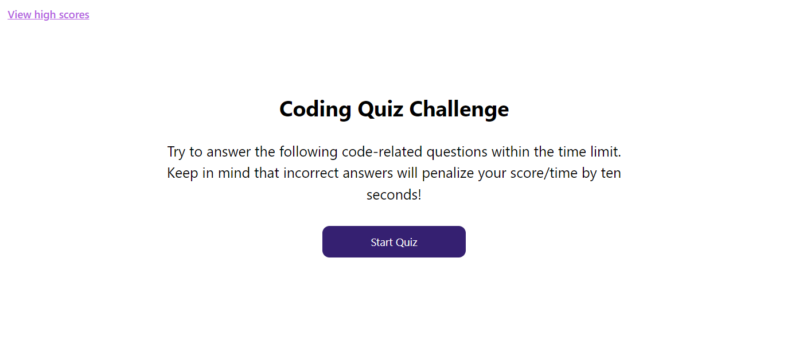

# code-quiz
A timed coding quiz with multiple-choice questions.

 

[Code Quiz Website](https://kevinchogan.github.io/code-quiz/)

## Description

An application that a hiring manager can use to vet prospective web developers.

## Installation

N/A

## Usage

* Click start button to begin quiz.
* Quiz ends when either all questions have been answered or timer runs out.
* Once quiz ends, enter name for high score list.
* Click "View high scores" button to see list of high scores.
* Click "Clear high scores" to reset the high score list.

Good luck!

## Credits

N/A

## License

Please refer to the LICENSE in the repo.
